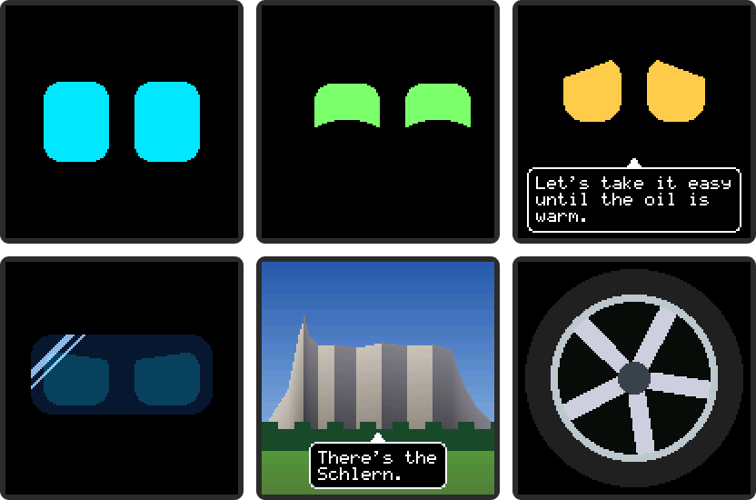

# Car Companion

A small companion for the dashboard of a Subaru BRZ, running on an Arduino
UNO Q. It shows an animated face on a 128 × 128 OLED, reacts to how the car
is driven, shows pictures when you drive into certain places, and is
configured from a phone app.



*Drawn by the simulator, pixel for pixel: calm, happy and looking around,
worried and talking, racing with the visor down, a place picture, a clip.*

Until the hardware arrives, a browser simulator stands in for the OLED, the
phone app, the car (OBD dongle) and the phone's GPS. All the features below work in it.

## Features

- **A face with moods**: neutral, happy, worried, angry, surprised, sleepy, suspicious and
  racing, each with its own shape and colour. He blinks, glances around (into the corners too,
  then back to the middle) and plays small animations.
- **Reacts to the car**: speed, revs, oil and coolant temperature and g-forces pick his mood.
  Happy and looking around when standing still, worried while the oil is cold, and from 90 km/h
  a visor slams down that lifts again 8 s after slowing down.
- **Feels the board move**: with a Modulino Movement, shaking the board makes him angry.
- **Talks**: short lines in a speech bubble on the display. How chatty he is can be set.
- **Knows places**: drive into a place and he shows its picture for a few seconds, with a line.
- **Clips**: add any video or GIF. It is scaled down to the display and shows every few minutes
  for a few seconds, optionally only when, say, you drive faster than 20 km/h.
- **Clear priorities**: a place picture comes first, then a clip, then the face.
- **Sleeps**: when the ignition goes off he falls asleep, and the display turns off.
- **Everything in JSON files**: faces, animations, rules, places, clips and settings, checked
  with clear error messages. A broken file falls back to the last good version, and changes
  apply live.
- **Configure dialog**: a face editor with a live preview, a table of which face goes with
  which car values, places with photos, clips, and every file as JSON.
- **Browser simulator**: the whole app on your PC, with a pixel-exact display, car controls and
  scenarios (cold start, launch, hard braking, ...), a map with a route player, and a log.
- **Safe with power cuts**: the car can cut the power at any moment. Files are written rarely
  and atomically, so they are never left half-written.
- **Small**: only the Python standard library and plain JavaScript (plus Leaflet for the map),
  no build step, unit tests for the logic.

## What you need

**To try it on a PC**, no hardware:

- Python 3.10 or newer, nothing to install
- A current browser. GIF clips need Chrome or Edge, and the map needs internet.

**To run it on the board:**

- An Arduino UNO Q, with its first-time setup done in Arduino App Lab
- Its USB-C cable, and a Linux or macOS PC with adb (Arch: `android-tools`, Debian and Ubuntu: `adb`)
- In the car: USB-C power for the board
- Optional: a Modulino Movement on the Qwiic connector, for the motion sensing

**The display** (drawing on it is the next step, see Progress):

- A 1.5" 128 × 128 RGB OLED with an SSD1351 driver (SPI). The board's pins are 3.3 V, so
  give the OLED 3.3 V too, not 5 V.

| OLED | UNO Q |
|---|---|
| VCC | 3.3V |
| GND | GND |
| DIN (MOSI) | D11 |
| CLK (SCK) | D13 |
| CS | D10 |
| DC | D8 |
| RST | D7 |

**Not needed yet**: an OBD-II dongle (the car's data is simulated for now) and the phone
app (the simulator's phone panel and map stand in for it).

## Progress

- [x] 1. App skeleton and simulator showing the eyes from `faces.json`
- [x] 2. Animation player and `animations.json`: blinking, glances, looking around, waking up, falling asleep
- [x] 3. Car panel and `rules.json`: speed, revs, temperatures, g-forces, scenarios; plus the Modulino Movement
- [x] 4. Places and location panel with a map and a route player (sunrise/sunset dimming still to do)
- [x] 5. Configure dialog: places with pictures, and every config file (the chat stub is still to do)
- [x] Face editor, faces by car data, speech bubble, video and GIF clips
- [ ] 6. LED matrix output on the board
- [ ] Drawing on the real OLED (measuring the Bridge's speed first)

## What he does

| Situation (first match wins) | Face |
|---|---|
| Cold oil (below 80 °C) at high revs (above 4500 rpm) | worried, nervous glances, "Easy, the oil is still cold." |
| Coolant from 105 °C | worried, nervous glances, a warning |
| Speed from 90 km/h | racing: he glances up, his visor slams down with a bounce and a glint sweeps across it; it moves with his eyes. 8 s after he drops below 90 km/h it lifts again (his eyes follow it up, then a relieved double blink) |
| Board shaken (Modulino Movement from 0.35 g) | angry, "Hey, stop shaking me!" |
| Standing still or crawling (below 5 km/h) | happy, looking around: quick glances to random spots and corners, then back to the middle |
| Driving with cold oil (below 50 °C) | worried |
| Anything else | neutral, an occasional glance |
| Hard braking, redline | surprised for a moment |
| Entering a place | its picture for a few seconds, and a line |
| Ignition off | falls asleep; the display goes off 20 s later |

What the display shows, most important first:

1. **A place picture**, when you enter a place, for its "Show picture (s)" (Configure, Places).
2. **A clip** (a video or GIF), each one every few minutes for a few seconds (Configure, Clips).
3. **The face**, with the moods and animations the rules choose.

What he says appears in a speech bubble on top of any of them, at the bottom
of the display (his face moves up to make room). When the ignition goes off he
falls asleep, and a little later the display turns off.
He blinks every few seconds (`blink_s` of the mood; worried blinks more).
All of this is set in the config files; nothing is hard-coded. The easy way
to change it is the Configure dialog in the simulator: **Faces** for how each
mood looks, **Car data** for which face goes with which car values.

## Run it on your PC

```bash
python3 tools/run_pc.py
```

Then open http://localhost:7000. Only Python 3 is needed, nothing to install.
With `--lan` you can also open it on your phone (same Wi-Fi, your PC's address).

The page:

- **Display**: the OLED, pixel for pixel, speech bubble included.
- **Phone app**: what he is doing and why (mood, active rules), buttons to preview moods and
  animations, and "Edit faces…".
- **Car**: ignition, speed and the other values, scenarios, and "Shake the board" in place of the motion sensor.
- **Location**: click the map to put the car there, jump to a place, type coordinates,
  or draw a route and drive it at the Car panel's speed (up to 60× faster than real time).
  Dashed circles show where a place is left again.
- **Log**: rules turning on and off, places, warnings, and his lines.
- **Configure** (top right):
  - **Faces**: pick a mood and shape it with sliders (width, height, roundness, slant, smile cut,
    colour, spacing, blinking, visor) while the preview draws it exactly like the display. Change
    both eyes or one; ↺ goes back to the default mood's value. Add and delete moods. With the
    visor down, the visor's own look (tint, reflection, darkness, size) can be changed too.
  - **Car data**: a table of ranges, e.g. "Speed from 90 km/h → racing" or "Oil to 50 °C →
    worried", with what the eyes do (as usual, look around, nervous, focused), how many seconds
    a row is kept after the value leaves its range, and an optional line. "⋯" sets the animations
    played when a row starts and when it ends. The highest matching row wins; ↑ ↓ change the
    order. Active rows are marked while you test.
  - **Places**: add and edit places with their pictures.
  - **Clips**: add videos and GIFs. Choose any file: it is scaled down to fit the display when it
    is bigger (never up), centred on black, and kept to 10 s at 10 frames a second, with a
    preview. Set how long it shows, how many minutes until it comes again, and optionally only
    when, e.g. `speed_kmh > 20`. "Play now" shows it at once.
  - **Files**: edit any config file as JSON.

The map needs internet (Leaflet and OpenStreetMap); the rest works without.

## Run it on the board

Connect the board to this PC with its USB-C cable, then:

```bash
tools/deploy.sh
```

It copies the app over the cable (adb, no Wi-Fi or password needed), restarts
it on the board (compiling and flashing the sketch, about a minute) and
makes the board's page available at http://localhost:7001. When the board is
on your Wi-Fi, the page is also at `http://<board's IP>:7000`, for example on
your phone. Config files and pictures already on the board are kept; add
`--config` to overwrite them with yours. The app also shows up in App Lab as
**Car Companion**.

The board's log:

```bash
adb shell TMPDIR=/tmp arduino-app-cli app logs /home/arduino/ArduinoApps/car-companion
```

### Modulino Movement

Plug a Modulino Movement into the board's Qwiic connector. The sketch
(`sketch/sketch.ino`) looks for it every 5 seconds and sends about 20
samples a second to Python, which turns them into `motion_g`: about 0.01 g
lying still, 0.5 g and more when shaken. The log says "Modulino Movement:
receiving data" when it works, and "not found on the Qwiic connector" when
there is none.

## Tests

```bash
python3 -m unittest
```

The logic in `python/companion/` has no Arduino imports, so the tests run on any PC.

## How it fits together

```
 phone app (simulated) ─┐                      ┌──────────────┐  scene  ┌─ simulator canvas
 car (simulated, later OBD) ─ messages / calls ▶│  Companion   │────────▶├─ LED matrix (step 6)
 Modulino Movement (sketch) ┘                   │  python/     │         └─ OLED (later)
                                                └──────┬───────┘
                                          config/*.json, assets/images/ (applied live)
```

| Path | What it is |
|---|---|
| `config/` | All behaviour: faces, animations, rules, places, settings. |
| `assets/images/` | Place pictures, 128 × 128 PNG. |
| `assets/clips/` | Clips: frames of 128 × 128 under each other in one tall PNG. |
| `python/main.py` | Board glue: WebUI and Bridge, connected to the Companion. |
| `python/companion/` | The logic, plain Python. `core.py` is the place to start. |
| `sketch/` | The microcontroller: reads the Modulino Movement; later the LED matrix and OLED. |
| `assets/` | The simulator page, served by the board or by `run_pc.py`. |
| `tools/` | `run_pc.py`, `deploy.sh`, `make_placeholders.py`, and the PC stand-in for Arduino's `arduino.js`. |
| `docs/` | Pictures for this README. Not copied to the board. |
| `tests/` | Unit tests for the logic. |
| `PROTOCOL.md` | Every message between app and companion, the scene format and the Bridge calls. |

## Config files

Edit them by hand, in the simulator (Configure, Files), or later from the
phone; changes apply within a second. When a file has a problem, the log and
the phone panel say exactly where, for example
`faces.json: moods.happy.h: expected a number, got "tall"`, and the companion
keeps running on the last good version (`config/.good/`), or on the built-in
defaults. Names one file uses from another (an unknown mood in a rule, a
missing picture) are reported as warnings.

### Add or change a mood (faces.json)

Easiest in the simulator: Configure, Faces (or "Edit faces…" in the Phone app
panel). Type a name and press Add to start from the mood you have selected,
shape it with the sliders, and save. By hand: a mood inherits everything from
the default mood (`neutral`) and only lists what changes:

```json
"sad": {"h": 30, "slant": -14, "color": "#5AA0FF"}
```

| Field | Meaning (pixels on the 128 × 128 display) |
|---|---|
| `w`, `h` | Eye width and height. |
| `r` | Corner radius. |
| `color` | `"#RRGGBB"`. |
| `slant` | Top edge lower at the inner side (angry), or with a negative value at the outer side (sad, worried). |
| `cut` | Pixels cut from the bottom by a curve, for happy ^ ^ eyes. |
| `gap` | Space between the eyes. |
| `blink_s` | `[min, max]` seconds between blinks, or `null` for no blinking. |
| `left`, `right` | Change one eye only, e.g. `"left": {"h": 18}`. |
| `visor` | How far the visor is down: 0 up (default) to 1 down. It slides when the mood changes. |

How the visor looks is set once, in `"visor"` at the end of faces.json:
`y` (its centre when down), `w`, `h`, `r`, `color` (the tint), `alpha` (0 clear
to 1 dark), `shine` (the reflection stripes) and `glint` (where they rest). The
eyes stay faintly visible behind it, and the visor moves with them.

### Add an animation (animations.json)

An animation is a list of steps, played one after the other. Each step
changes what it names, smoothly from where the eyes are:

```json
"nod": {"steps": [{"look": [0, 0.6], "ms": 150, "hold_ms": 100}, {"look": "center", "ms": 200}], "repeat": 2}
```

| Step field | Meaning |
|---|---|
| `mood` | Change to this mood. |
| `look` | `[x, y]` from -1 to 1 (right and down are positive), `"center"`, or `"random"` (any spot up to the corners). |
| `blink` | Eyelids: 0 open, 1 closed. |
| `visor` | Move the visor on its own: 0 up, 1 down, up to 1.2 to bounce past its place. |
| `glint` | Move the visor's reflection across it: about -0.3 (gone left) to 1.4 (gone right); it rests at 0.2. |
| `ms` | How long the change takes. |
| `ease` | `linear`, `in` (slow start), `out` (fast start, soft stop: eye movements), `smooth` (default). |
| `hold_ms` | Pause after the change. |
| `repeat` | Do this step several times. |
| `anim` | Play another animation here, e.g. `{"anim": "double_blink"}`. |

Any number can be `[min, max]` for a random value, e.g. `"hold_ms": [300, 1100]`.
For the whole animation: `repeat`, and `"keep": true` to stay in its last
mood (otherwise the eyes return to the rules' mood and to the middle).
An animation that changes the shape (a mood, the visor or its glint) delays a
mood change from the rules until it ends; that is how `visor_down` brings the
visor down before the racing face takes over.
`blink`, `double_blink`, `wake_up` and `sleep` are used by the companion itself.

### Add a rule (rules.json)

For a face that goes with a range of one car value, use the simulator:
Configure, Car data, Add range. Pick the value (speed, RPM, oil, coolant,
braking, cornering, board shaken), set "from" and/or "to", the face, what the
eyes do and an optional line, move the row to where it belongs, and save.
Each row becomes a rule like `{"id": "speed_angry", "when": ["speed_kmh >= 100"], "mood": "angry"}`.

For anything else, write the rule by hand (or under Configure, Files):

```json
{"id": "cold_oil_rev", "when": ["oil_c < $oil_warm_c", "rpm > 4500"], "mood": "worried",
 "say": "Easy, the oil is still cold.", "level": 1, "cooldown_s": 120}
```

| Field | Meaning |
|---|---|
| `id` | Short name, shown in the log. |
| `when` | Conditions that must all be true: `"<signal> <op> <value>"` with `<`, `<=`, `>`, `>=`, `==`, `!=`. The value can be a number, `true`/`false`, a word, or `$name` for a threshold from settings.json. |
| `mood` | His mood while the rule is active. |
| `idle` | What the eyes do meanwhile, e.g. `{"play": ["look_around"], "every_s": [0.5, 2]}`. |
| `play` | An animation, played when the rule becomes active. |
| `play_end` | An animation, played when the rule stops being active (after `hold_s`). |
| `say` | A line, said when the rule becomes active. |
| `level` | 1 important, 2 normal, 3 chatter. Said only up to `chattiness` in settings. |
| `cooldown_s` | At least this long before `play` and `say` fire again (default 30). |
| `hold_s` | Stay active this long after the conditions stop (smooths out flickering). |
| `note` | Your comment; ignored. |

Signals: `ignition`, `speed_kmh`, `rpm`, `oil_c`, `coolant_c`, `g_long`
(braking is negative), `g_lat` (left turn is negative), `motion_g`
(Modulino Movement), `place` (id of the place you are in), `running_s`
(seconds since the ignition went on). **The order is the priority**: when
several active rules have a mood, the first one in the file wins. That is why
the warnings come first, then speed, then the Modulino.

### Add a place (places.json)

Easiest in the simulator: Configure, Places, Add place. Click the map first
and use "Use the map position", choose any photo (it is cropped to the middle
square and scaled to 128 × 128 in the browser), and save. By hand:

```json
{"id": "kastelruth", "name": "Kastelruth / Castelrotto", "lat": 46.567, "lon": 11.567, "radius_m": 2000,
 "image": "schlern.png", "caption": "Schlern", "say": "There's the Schlern.", "show_s": 8, "cooldown_min": 60}
```

The picture must be a 128 × 128 PNG in `assets/images/`. A place triggers
when you come closer than `radius_m`, and is left only beyond
`radius_m × (1 + place_exit_margin)`, so GPS jitter at the edge does not
trigger it again; after that it stays quiet for `cooldown_min` (the log says
so). `python3 tools/make_placeholders.py` redraws the two placeholder pictures.

### Add a clip (clips.json)

Easiest in the simulator: Configure, Clips, Add clip, choose a video or GIF,
save. Each clip is one tall PNG in `assets/clips/` (its frames under each
other, each 128 × 128) and an entry like:

```json
{"id": "wheel", "name": "Spinning wheel", "file": "wheel.png", "frames": 16, "fps": 12,
 "show_s": 5, "every_min": 5, "enabled": true, "when": ["speed_kmh > 20"]}
```

`show_s` is how long it plays (looping), `every_min` how long until it comes
again, `when` (optional) conditions like in rules.json. When several clips are
due, the first in the file plays first. A place picture cuts a clip short; it
then waits for its next turn.

### settings.json

Settings you leave out use the defaults in `python/companion/defaults.py`.

| Field | Meaning |
|---|---|
| `displays` | 1: both eyes on one OLED. 2: one OLED per eye. |
| `fps` | Scene updates per second. |
| `brightness.mode`, `brightness.manual` | `"manual"` with a percentage; `"auto"` will follow sunrise and sunset. |
| `layout` | How far the eyes move when looking around, and their size with two displays. |
| `mood_ms` | How long a change of mood takes. |
| `idle` | Animations played now and then when no rule says otherwise, and how often. |
| `chattiness` | 0 silent, 1 important lines only, 2 normal, 3 everything. |
| `bubble` | The speech bubble: `enabled`, `color` (outline and text), shown for `min_s` plus `per_char_s` per character (at most 10 s). Up to 3 lines of 18 characters; longer lines end with "...". |
| `say_gap_s` | At least this long between two lines. |
| `sleep_after_off_s` | Display off this long after the ignition is turned off. |
| `place_exit_margin` | How much farther than its radius a place is left (0.2 = 20 %). |
| `thresholds` | Numbers the rules use as `$name`. Add your own. |

## Where the next parts plug in

- **OLED**: a renderer in the sketch that draws scenes by the rules in
  PROTOCOL.md; `python/main.py` forwards scenes over Bridge. The logic does not change.
- **BLE to the phone**: a second transport in `python/main.py` carrying the same messages.
- **OBD dongle**: replaces `car_sim.py` behind the same interface (`state`, `tick()`).
- **GPS from the phone**: the same `location` message the map sends now.
- **Brightness from sunrise/sunset**: `Companion._brightness()`.
- **AI chat and voice**: a `chat` message, and speaking the `say` messages.
